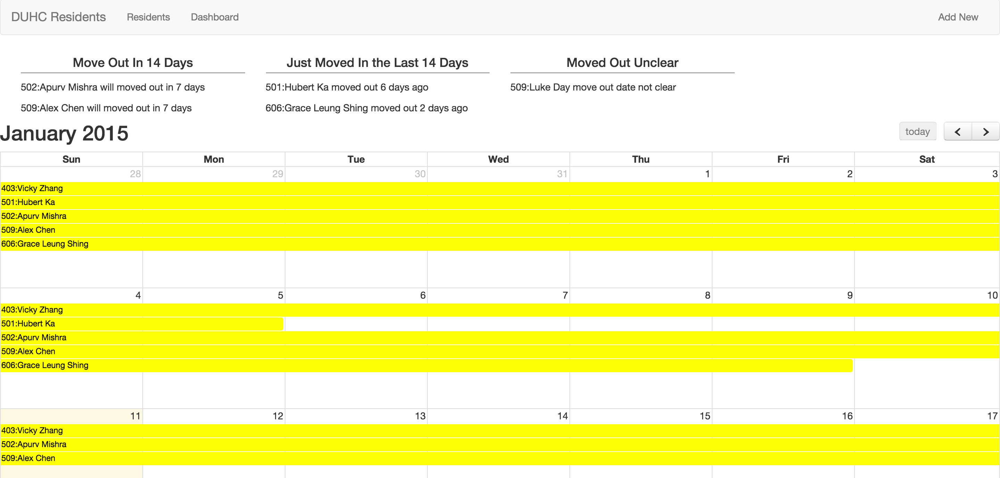
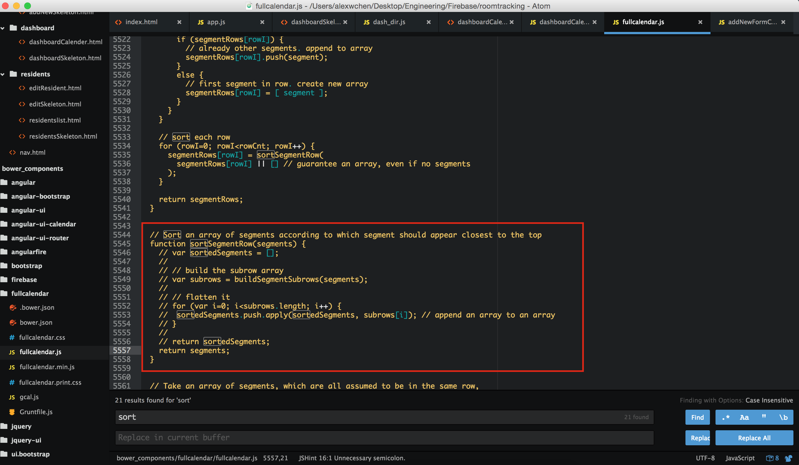

DUHC Room Management System
===================

#### Demo:



How to start?
```
npm start
```

This is a minimal room management system made for Draper University and Herocity

Link: https://roomtracking.firebaseapp.com

#### Setup Firebase
```javascript
.constant('FirebaseRoot', 'https://roomtracking.firebaseio.com/')
```

#### Setup Fields
```javascript
.constant('ResFields', ['Name','Room', 'Category', 'Email','Start Date','End Date','Waiver Recievd', 'Security Deposit', 'Notes', 'Paid Rooms', 'Paid Desk']);
```

#### Sorce Mod:
I changed this the calender won't sort by event length

